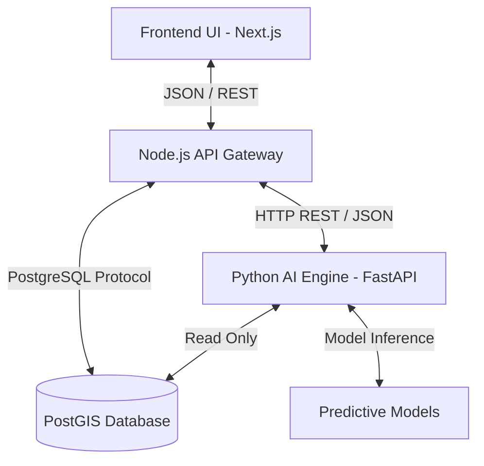

# AI Service Architecture — SmartRoad Rwanda

## Overview
SmartRoad Rwanda employs a **Microservices Architecture** to integrate AI capabilities. To leverage the massive ecosystem of data science tools (Pandas, Scikit-Learn, PyTorch), the AI Intelligence Layer operates as an independent Python service communicating with the primary Node.js backend.

## System Architecture

## Data Flow
1. **Client Request:** The user navigates to the AI Insights dashboard. The Next.js frontend requests `/api/ai/road-condition/:id` from the Node.js backend.
2. **Backend Proxy:** Node.js receives the request, gathers any necessary contextual data from its services, and forwards the payload to the Python AI engine at `http://localhost:8000/predict/road-condition`.
3. **AI Inference:** The FastAPI server parses the request, loads the appropriate statistical model, and generates a prediction.
4. **Explainable AI Formulation:** The Python service appends human-readable *Reasons* and *Recommended Actions* to the raw prediction.
5. **Response:** The enriched payload is returned through Node.js to the frontend for rendering.

## Model Lifecycle
1. **Data Collection:** Sourcing traffic surveys, pavement condition index (PCI) scores, and historical crash reports.
2. **Data Processing:** Cleaning anomalies, normalizing values, and feature engineering (e.g., calculating heavy vehicle percentages).
3. **Model Training:** Training regression or classification models (e.g., Random Forest, XGBoost) using Scikit-Learn.
4. **Prediction:** Exposing the model via FastAPI endpoints for real-time or batch inference.
5. **Engineering Recommendation:** Translating statistical outputs (e.g., `risk_score: 0.85`) into actionable transportation engineering decisions (e.g., "Schedule Immediate Inspection").
